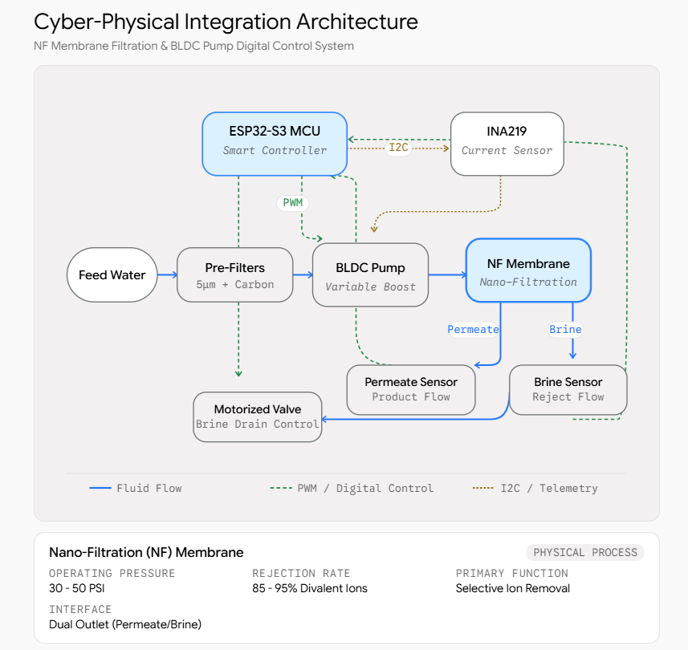

# المنظومة الذكية للترشيح النانوي للمياه الجوفية
## Smart Nano-Filtration Cyber-Physical System (NF-CPS)

[](https://platformio.org/)
[](https://www.espressif.com/)
[](https://en.cppreference.com/)
[](https://developer.mozilla.org/)
[](https://katex.org/)
[](#)

---

## 📌 نبذة عامة عن المشروع (Project Overview)

مشروع هندسي تنافسي تم تطويره للمشاركة في **مسابقات الابتكار الهندسي الطلابي**. يقدم المشروع نموذجاً أولياً لمحطة معالجة مياه جوفية مصغرة ومحمولة، قائمة على مفاهيم **الأنظمة السيبرانية-الفيزيائية (Cyber-Physical Systems - CPS)**، وتستهدف المناطق الريفية والنائية وحالات الإغاثة الطارئة.

تعتمد المنظومة على دمج متحكم دقيق متقدم (**ESP32-S3**) مع أغشية الترشيح النانوي (**Nanofiltration - NF 1812-50**)، وصمامات آلية منعدمة استهلاك التثبيت (**0-Watt Holding Power**)، ومضخات متغيرة السرعة يتم التحكم بها عبر خوارزميات **PWM** مغلقة الحلقات، مما يحقق وفراً طاقياً يتجاوز **66%** مقارنة بأنظمة التناضح العكسي (RO) التقليدية مع مضاعفة نسبة استرداد المياه النقية.

---

## 🚀 الابتكارات الهندسية الرئيسية (Key Innovations)

1. **الترشيح النانوي الأيوني الانتقائي (Selective Nanofiltration):**
   * ضغط تشغيل منخفض يتراوح بين **30 إلى 50 PSI** فقط (مقارنة بـ 80-110 PSI في أنظمة RO)، مما يخفض استهلاك طاقة الضخ إلى النصف.
   * إزالة انتقائية بنسبة **85% - 95%** لأيونات العسر والمعادن الثقيلة ($\text{Ca}^{2+}$, $\text{Mg}^{2+}$, $\text{SO}_4^{2-}$)، مع الحفاظ على التوازن المعدني الصحي الطبيعي دون الحاجة لمراحل إعادة تمعدن كيميائية.
2. **صمامات آلية منعدمة استهلاك التثبيت (0-Watt Holding Power):**
   * استخدام صمام كروي كهربائي آلي (**CWX-15Q**) يستهلك نبضة تيار قدرها 150mA لمدة 3-5 ثوانٍ فقط أثناء الحركة، ثم ينقطع التيار تماماً ليثبت عند **0.00 واط**، متفوقاً بنسبة **99.8%** على صمامات السولينويد التقليدية التي تهدر 8-12 واط مستمرة.
3. **التحكم المغلق بمضخة BLDC (Closed-Loop Telemetry Control):**
   * قيادة محرك المضخة عبر ترانزستور **LR7843 MOSFET** بتردد فوق صوتي (20kHz).
   * مراقبة تيار الجهد العالي عبر مستشعر **INA219** لحساب القدرة واكتشاف بوادر الانسداد التكلسي (Fouling).
   * تنفيذ دورات غسيل عكسي آلي دوري (**Automated Flushing Routine**) لحماية المسام وإطالة عمر الغشاء الافتراضي لثلاثة أضعاف.

---

## 🏗️ هيكلية النظام السيبراني-الفيزيائي (System Architecture)



### مسارات التدفق والاتصال:
* **المسار الهيدروليكي (Physical):** مياه التغذية الخام $\rightarrow$ مرشحات أولية (5µm + كربون نشط) $\rightarrow$ مضخة التعزيز 24V BLDC $\rightarrow$ غشاء الترشيح النانوي NF $\rightarrow$ مخرج المياه النقية (Permeate) ومخرج المياه المركزة (Brine).
* **طبقة الاستشعار والقياس (Telemetry):** ناقل **I2C** لمستشعر القدرة INA219، مقاطعات العتاد السريعة (**Hardware ISR**) لحساس التدفق YF-S201، ومستشعر الملوحة التناظري (Analog TDS) بتعويض حراري متعدد الحدود.
* **طبقة التنفيذ والتحكم (Actuation):** إشارات تعديل عرض النبضة (PWM) لوحدة LR7843، وإشارات رقمية للتحكم بالصمام الكروي CWX-15Q.
* **واجهة المراقبة (HMI):** شاشة ملونة **ILI9341 2.8" SPI TFT** لعرض مؤشرات التدفق، وجودة المياه، واستهلاك الطاقة وساعات التشغيل.

---

## 💰 قائمة المكونات والتكلفة بالسوق المصري (Bill of Materials)

جميع المكونات تم استخراج أسعارها الفعلية من كبرى المتاجر الإلكترونية المتخصصة في مصر (RAM Electronics, Future Electronics, السوق الصناعي المصري):

| المكون الهندسي | الوظيفة في المنظومة | المصدر بالسوق المصري | السعر الفعلي (EGP) |
|---|---|---|---|
| **ESP32-S3-WROOM-1 Dev Board** | وحدة المعالجة المركزية وتنفيذ خوارزميات التحكم | RAM Electronics | 500.00 EGP |
| **Vontron NF Membrane 1812-50** | غشاء الترشيح النانوي الأيوني منخفض الضغط | موزعي مرشحات المياه بمصر | 750.00 EGP |
| **24V DC Brushless Variable Boost Pump** | مضخة تعزيز متغيرة السرعة للتحكم الهيدروليكي | Future Electronics / Industrial | 1,200.00 EGP |
| **CWX-15Q 1/2" Motorized Ball Valve** | صمام كروي آلي بتثبيت منعدم الاستهلاك (0-Watt) | المتاجر الصناعية المصرية | 499.00 EGP |
| **INA219 I2C Current & Power Sensor** | مراقبة جهد وتيار المضخة واكتشاف الحمل الزائد | Future Electronics / Amazon.eg | 185.00 EGP |
| **YF-S201 Water Flow Rate Sensor** | قياس معدل التدفق عبر مقاطعات الهاردوير | RAM Electronics | 200.00 EGP |
| **Analog TDS Sensor Meter V1.0** | قياس ملوحة ونقاء المياه في الزمن الحقيقي | RAM Electronics | 450.00 EGP |
| **ILI9341 2.8" SPI TFT Display** | شاشة العرض والرسوم البيانية الميدانية | RAM Electronics | 650.00 EGP |
| **LR7843 15A 400W MOSFET Module** | قيادة وتبديل نبضات PWM عالية السرعة | RAM Electronics | 45.00 EGP |
| **LM2596HVS Step-Down Buck Converter** | تنظيم جهود التشغيل (حتى 60V) بكفاءة 92% | RAM Electronics | 65.00 EGP |
| **الإجمالي (Total Capital Cost)** | **تكلفة النموذج الأولي الكامل للمنظومة** | **السوق المصري الإلكتروني** | **4,544.00 EGP** |

---

## 💻 البرمجيات المدمجة (Firmware & PlatformIO)

تم بناء المشروع بالكامل باستخدام إضافة **PlatformIO** داخل **VS Code** باعتبارها البيئة الهندسية الاحترافية للأنظمة المدمجة:

* **المعيار البرمجي:** لغة **C++17** الحديثة.
* **إدارة المكتبات الحتمية:** عبر ملف `platformio.ini` دون أي تعارضات في التعريفات.
* **معايير الأمان البرمجي:** كود مدمج نظيف وخالٍ تماماً من الحروف غير اللاتينية داخل ملفات المصدر لضمان سلامة التجميع (Zero non-ASCII in code blocks).

```ini
; platformio.ini Configuration Snippet
[env:esp32-s3-devkitc-1]
platform = espressif32 @ 6.5.0
board = esp32-s3-devkitc-1
framework = arduino
monitor_speed = 115200

build_flags = 
    -D CORE_DEBUG_LEVEL=3
    -std=gnu++17

lib_deps = 
    adafruit/Adafruit INA219 @ ^1.2.3
    adafruit/Adafruit GFX Library @ ^1.11.9
    adafruit/Adafruit ILI9341 @ ^1.6.0
    Wire
    SPI
```

---

## 🌐 موقع العرض التفاعلي وجاهزية تصدير الـ PDF

يتضمن المشروع موقع عرض ويب ثابت (**Static Web Presentation**) مكوناً من **10 شرائح تفاعلية** بدقة شاشة كاملة (`100vh`) مع دعم كامل للطباعة والتحويل لملف PDF جاهز للتحكيم الأكاديمي:

* **تصفح الشرائح (Web Presentation):** يعتمد على **Pure CSS Scroll Snap** (`scroll-snap-type: y mandatory;`) لتجربة تمرير سلسة دون أي تدخل برمجي في التخطيط.
* **محرك الرياضيات والكيمياء (KaTeX):** معالجة فورية لمعادلات وصيغ الأيونات الكيميائية ($\text{Ca}^{2+}$, $\text{Mg}^{2+}$, $\text{SO}_4^{2-}$) مع عزل كامل لاتجاه النصوص (LTR Isolation).
* **محاكي القدرة والتدفق (Interactive Simulator):** أداة حية في الشريحة 9 تتيح للزوار اختبار تأثير ملوحة المياه (TDS) وسرعة المضخة (PWM) على الضغط واستهلاك القدرة.
* **تصدير PDF قياسي مطبوع (`@media print`):**
  * كل شريحة تُطبع تلقائياً في صفحة **A4 بالعرض (Landscape)** مستقلة عبر `page-break-after: always;`.
  * عزل تام لكافة أدوات التحكم التفاعلية والأزرار العائمة أثناء الطباعة.
  * الحفاظ على خلفيات الأكواد البرمجية الداكنة بثيم **VS Code Dark** عبر `print-color-adjust: exact;`.

---

## 🛠️ كيفية التشغيل والمعاينة المحلية (Local Setup)

1. **استنساخ المستودع (Clone Repository):**
   ```bash
   git clone https://github.com/<your-username>/<repo-name>.git
   cd <repo-name>
   ```

2. **تشغيل خادم محلي بسيط (Local HTTP Server):**
   ```bash
   # باستخدام Python 3
   python -m http.server 8080
   ```
   ثم افتح المتصفح على: `http://localhost:8080/index.html`

3. **تصدير شرائح العرض كملف PDF:**
   * اضغط على زر **"طباعة / تصدير PDF"** العائم أسفل يسار الشاشة أو اضغط `Ctrl + P`.
   * اختر الوجهة **Save as PDF**.
   * اختر الاتجاه **Landscape (أفقي)**، ومقاس الورق **A4**.
   * تأكد من تفعيل خيار **Background graphics (رسومات الخلفية)**.

---

## 🚀 النشر على GitHub Pages

المشروع مصمم ليعمل مباشرة وبشكل فوري على **GitHub Pages**:
1. ارفع الكود إلى مستودع GitHub الخاص بك.
2. توجه إلى إعدادات المستودع (**Settings**) $\rightarrow$ ثم قسم **Pages**.
3. تحت خيار **Build and deployment**:
   * المصدر: **Deploy from a branch**.
   * الفرع: `main` والمجلد: `/ (root)`.
4. اضغط **Save**، وسيكون الموقع متاحاً عالمياً خلال ثوانٍ عبر الرابط:
   `https://<your-username>.github.io/<repo-name>/`

---

## 📁 هيكلية ملفات المشروع (Repository Structure)

```text
├── .gitignore                     # استبعاد الملفات التنفيذية والمؤقتة الضخمة
├── index.html                     # هيكل العرض التقديمي الدلالي (10 شرائح)
├── style.css                      # أنماط التصميم ونظام Scroll-Snap وقواعد @media print
├── script.js                      # سكريبت KaTeX، وتلوين Prism، والمحاكي التفاعلي
├── README.md                      # التوثيق الهندسي الشامل للمشروع
└── assets/
    ├── components.json            # بيانات وتفاصيل أسعار المكونات بالسوق المصري
    ├── images/                    # الصور الفعلية للمكونات ومخطط الهيكلية
    │   ├── esp32_s3.jpg
    │   ├── vontron_nf_membrane.jpg
    │   ├── bldc_pump_24v.jpg
    │   ├── cwx15q_ball_valve.jpg
    │   ├── ina219_sensor.jpg
    │   ├── yf_s201_flow_sensor.jpg
    │   ├── analog_tds_sensor.jpg
    │   ├── ili9341_tft_display.jpg
    │   ├── lr7843_mosfet.jpg
    │   ├── lm2596_buck_converter.jpg
    │   └── project_diagram.png
    └── executable and other files/ # برمجيات تثبيت مستبعدة من Git
```

---

## 📄 الترخيص (License)
هذا المشروع منشور تحت رخصة **MIT License** لأغراض البحث العلمي والمسابقات الطلابية الهندسية.
